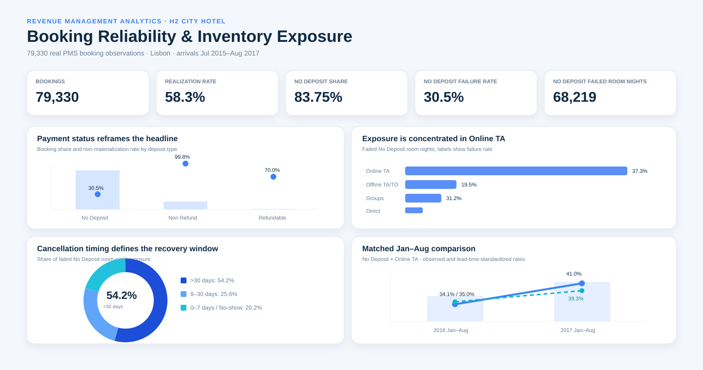

# H2 City Hotel - Booking Reliability & Inventory Exposure

**Business analytics case | 79,330 real bookings | Lisbon | Jul 2015-Aug 2017**

> **Management question:** Which booked demand should the hotel rely on, where is inventory exposure concentrated among No Deposit bookings, and which operating or policy changes are supported by the available evidence?

This project treats **H2 City Hotel as a single operating property**. The analysis focuses on questions the dataset can answer with reasonable confidence: booking reliability, concentration of failed room-night exposure, cancellation timing, forecast confidence, and the evidence required before broader commercial-policy changes are made.

## Primary deliverables

### 1. Management report

**[Read the business analytics report](report/REPORT.md)**

A concise management report linking the observed booking patterns to practical operating decisions while keeping causal and financial conclusions within the limits of the data. It covers:

- deposit status and booking non-materialization;
- channel concentration of failed room-night exposure;
- lead-time reliability and long-horizon planning risk;
- cancellation timing and the time available to attempt inventory recovery;
- a matched-period comparison of the core No Deposit + Online TA cohort;
- actions supported by the current evidence and policy changes that still require prospective measurement;
- additional economic fields required before policy ROI can be estimated.

### 2. Interactive dashboard

[](https://raw.githack.com/TangsBigPiggy/business-analytics-portfolio/main/01-hotel-booking-reliability/dashboard/index.html)

**[Open the live dashboard](https://raw.githack.com/TangsBigPiggy/business-analytics-portfolio/main/01-hotel-booking-reliability/dashboard/index.html)** · [View source](dashboard/index.html)

The browser dashboard loads the public source mirror, retains City Hotel only, validates the 79,330-row scope, and recomputes the figures when filters change. The written report records the management interpretation.

## Executive findings

The evidence supports **targeted operating changes, not broad commercial restrictions**.

- **No Deposit is the primary scope for bookings with no recorded deposit payment:** 66,442 bookings, **83.75%** of H2, with a **30.5%** non-materialization rate and **68,219 failed booked room nights**. The public extract does not identify every possible card, contractual, or channel-level guarantee, so "No Deposit" should not be read as proof of complete financial exposure.
- **The Non Refund pattern requires operational validation:** 12,868 bookings show a **99.8%** non-materialization rate. The source defines Non Refund as payment equal to or above the total stay cost. The unusually concentrated outcome should be validated against booking/block, settlement, and status-coding processes; it should not be treated as a general benchmark for non-refundable policy performance.
- **Online TA is the largest No Deposit exposure pool:** it represents **58.3%** of No Deposit bookings but **75.8%** of failed No Deposit room nights. After standardizing the lead-time mix, non-materialization remains **36.2% for Online TA vs 19.4% for Direct**. This supports channel-specific monitoring and testing, not a causal claim that the channel itself creates the difference.
- **Long-lead No Deposit Online TA is the largest identified planning-risk cohort:** bookings made 91+ days ahead represent **21.5%** of No Deposit bookings but **36.5%** of failed No Deposit room-night exposure, with a **46.0%** non-materialization rate.
- **Most failures in that long-lead cohort occur early enough to leave time for recovery attempts:** cancellations accounting for **82.6%** of its failed room nights occur more than 30 days before arrival. The issue is therefore both forecast reliability and post-cancellation inventory management.
- Across all No Deposit failures, cancellations accounting for **54.2%** of failed room-night exposure occur more than 30 days before arrival. A further **20.2%** falls into no-show or 0-7 day leakage, where recovery time is limited. The dataset does not show whether canceled inventory returned to sale or was subsequently resold.
- In the matched Jan-Aug comparison, No Deposit + Online TA bookings grew **26.9%** from 2016 to 2017 while failed room nights grew **55.8%**. The lead-time-standardized non-materialization rate increased by **4.3 percentage points**, indicating that cohort reliability should be refreshed rather than treated as a fixed planning assumption.

## Management interpretation

The current evidence supports three operating changes and one testing requirement:

1. **Forecasting:** use lower reliability assumptions for long-lead No Deposit Online TA bookings rather than applying a single realization rate to all booked demand.
2. **Inventory recovery:** after an early cancellation, verify that inventory is returned promptly to the sellable pool, subject to room-type and overbooking controls, and measure the subsequent resale outcome.
3. **Near-arrival controls:** evaluate targeted confirmation or guarantee controls for cohorts with late cancellation and no-show exposure, with conversion and guest-experience effects measured prospectively.
4. **Commercial policy:** test tighter channel or deposit terms before broad rollout. The historical extract does not observe booking conversion, resale economics, final settlement, commission, or contribution margin.

Any future intervention should be judged on **net economics and forecast reliability**, not on cancellation rate in isolation.

## Analytical limits

`Failed booked room nights` is an **inventory-exposure measure**, not a lost-revenue estimate. The source data do not contain daily available-room inventory, observed resale of canceled rooms, final payment settlement, channel commission, contribution margin, or booking-funnel conversion.

Accordingly, the project does not report occupancy, RevPAR, GOPPAR, or policy ROI. It also does not claim that channel, lead time, or another booking attribute causally produces the observed non-materialization rates.

## Repository structure

```text
01-hotel-booking-reliability/
├── README.md
├── ATTRIBUTION.md
├── analysis.py
├── requirements.txt
├── dashboard/
│   ├── index.html
│   └── preview.svg
├── report/
│   └── REPORT.md
└── docs/
    └── METHOD.md
```

The source data are not duplicated in this portfolio repository. The analysis script and browser dashboard read the public **TidyTuesday mirror of the Antonio, de Almeida & Nunes dataset**, then retain `City Hotel` only. This keeps the case reproducible while preserving clear attribution to the original publication.

## Reproduce the analytical checks

```bash
pip install -r requirements.txt
python analysis.py
```

The script validates the **79,330-row H2 scope**, reconciles `is_canceled` with final booking status, and reproduces the principal management metrics from the public source mirror.

## Data source

Original publication: Nuno Antonio, Ana de Almeida, Luis Nunes. *Hotel booking demand datasets*. **Data in Brief 22 (2019), 41-49.** DOI: 10.1016/j.dib.2018.11.126. H2 is the City Hotel property in Lisbon. The article and data are published under **CC BY 4.0**.

For reproducible code delivery, this repository reads the cleaned public mirror maintained by the **TidyTuesday / Data Science Learning Community** project; the mirror is derived from the same published H1/H2 files.