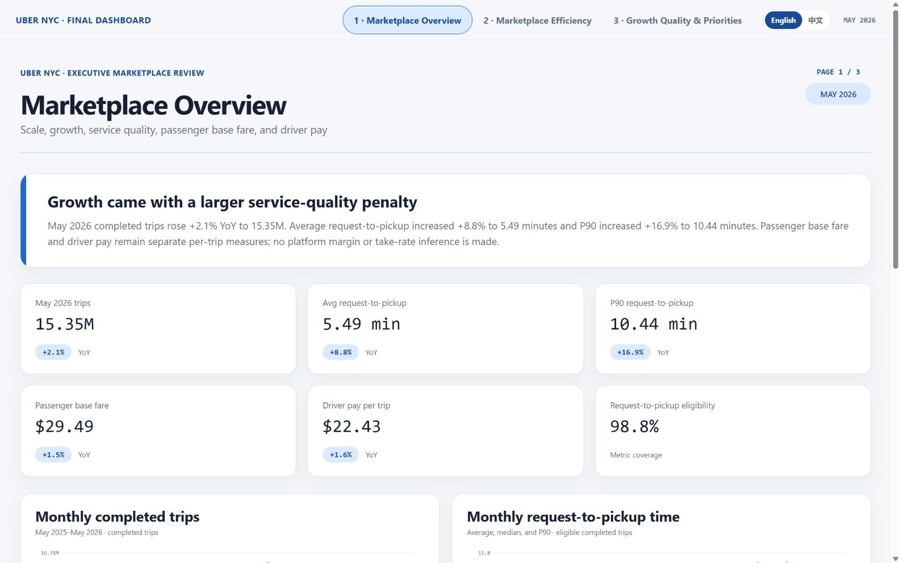
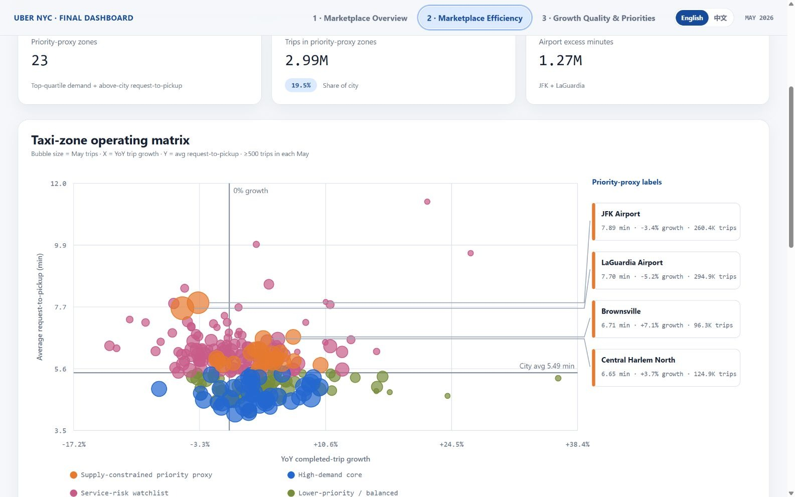
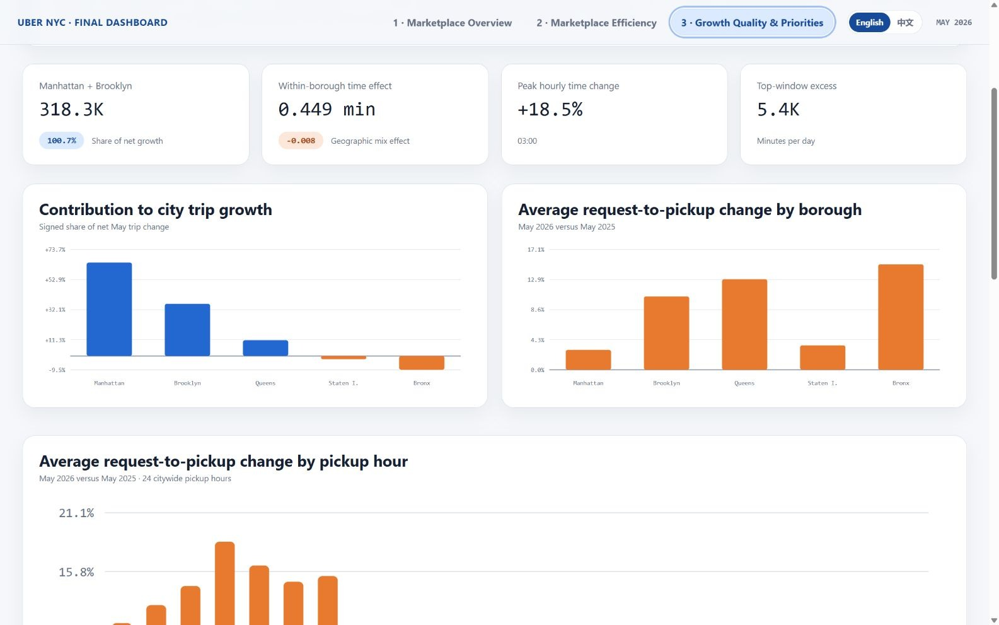

# Uber NYC Marketplace Analytics

[**English**](README.md) | [**中文**](README_zh.md)

**193.4M completed Uber trips · 13 months · New York City · Python + DuckDB**

> **Business question:** Did May 2026 trip growth come with worsening marketplace service quality—and where should operators investigate first?

[**Open the bilingual 3-page dashboard**](https://raw.githack.com/TangsBigPiggy/business-analytics-portfolio/main/02-uber-nyc-growth-quality/dashboard/uber_nyc_final_dashboard.html?lang=en#page-1) · [**Read the English executive report**](https://raw.githack.com/TangsBigPiggy/business-analytics-portfolio/main/02-uber-nyc-growth-quality/reports/uber_nyc_growth_quality_report_en.html) · [**Read the Chinese executive report**](https://raw.githack.com/TangsBigPiggy/business-analytics-portfolio/main/02-uber-nyc-growth-quality/reports/uber_nyc_growth_quality_report_zh.html) · [**Reproduce the analysis**](#reproduction)

[](https://raw.githack.com/TangsBigPiggy/business-analytics-portfolio/main/02-uber-nyc-growth-quality/dashboard/uber_nyc_final_dashboard.html?lang=en#page-1)

**Headline:** May 2026 completed trips increased **2.1% YoY** to **15.35M**, while average request-to-pickup increased **8.8%** to **5.49 minutes** and P90 increased **16.9%** to **10.44 minutes**. Growth and service deterioration occurred together; the public data does not establish causality.

The dashboard is one self-contained HTML file with three page tabs and an **English / 中文** switch. Both languages use the same validated datasets and rendering logic; no remote scripts or styles are required.

## Executive Findings

1. **Trip growth was modest; the service-quality movement was larger.** May 2026 added 315,947 completed trips versus May 2025, while average and tail request-to-pickup rose materially faster.
2. **The time increase was broad, not a geographic-mix effect.** The validated decomposition assigns **+0.449 minutes** to within-borough movement; geographic mix offset roughly **0.008 minutes**, reconciling to the **+0.442-minute** citywide change.
3. **Growth was concentrated, while service deterioration extended across boroughs.** Manhattan and Brooklyn added **318.3K completed trips**—**100.7%** of net city growth because declines elsewhere offset part of the gain. Average request-to-pickup increased in all five boroughs.
4. **The supply-constrained priority proxy identified 23 taxi zones.** These zones represented **2.99M trips**, or **19.5%** of May 2026 volume. JFK and LaGuardia ranked first and second by estimated excess request-to-pickup burden, totaling about **1.27M minutes** versus the city average. This is an operating-priority proxy, not causal proof of insufficient driver supply.
5. **The largest hourly deterioration appeared overnight.** The 03:00 pickup hour recorded the largest YoY average request-to-pickup increase at **18.5%**.

## Business Recommendations

- **Protect airport service quality first.** Review late-evening and overnight JFK/LGA staging, queue release, dispatch, and pickup-process playbooks using the ranked weekday-hour windows.
- **Run localized diagnostics before broad demand stimulation.** Prioritize the highest-burden Harlem, Brooklyn, and Bronx zones and evaluate dispatch, driver-positioning, and pickup-process changes with phased or randomized tests where possible.
- **Treat 00:00–07:00 as a focused service-recovery window.** Track completed trips, average request-to-pickup, and P90 request-to-pickup together as guardrails.
- **Add internal marketplace data before making causal claims.** Cancellations, unserved requests, driver online time, dispatch acceptance, surge, reservations, and promotion exposure are required to distinguish supply, dispatch, product, and reporting explanations.

## Dashboard Preview

### Page 1 — Marketplace Overview

[](https://raw.githack.com/TangsBigPiggy/business-analytics-portfolio/main/02-uber-nyc-growth-quality/dashboard/uber_nyc_final_dashboard.html?lang=en#page-1)

### Page 2 — Marketplace Efficiency

[](https://raw.githack.com/TangsBigPiggy/business-analytics-portfolio/main/02-uber-nyc-growth-quality/dashboard/uber_nyc_final_dashboard.html?lang=en#page-2)

### Page 3 — Growth Quality & Operating Priorities

[](https://raw.githack.com/TangsBigPiggy/business-analytics-portfolio/main/02-uber-nyc-growth-quality/dashboard/uber_nyc_final_dashboard.html?lang=en#page-3)

Every image is captured directly from the checked-in unified HTML. Page 2 uses a fixed callout rail with leader lines and non-overlapping numeric summaries for the four executive-priority zones.

## Methodology / Data Pipeline

```text
13 monthly TLC HVFHV Parquet files (~6.13 GB)
                    │
                    ▼
       DuckDB scan + Uber filter (HV0003)
                    │
                    ▼
 Compact analytics marts (month / day / zone / hour)
                    │
                    ▼
 May 2026 vs May 2025 diagnostics and decomposition
                    │
          ┌─────────┴─────────┐
          ▼                   ▼
 Bilingual reports    One bilingual 3-page dashboard
          └─────────┬─────────┘
                    ▼
      Numerical, bilingual, structural, and visual QA
```

- DuckDB scans the raw monthly Parquet files directly; the pipeline never creates one giant in-memory pandas table.
- Every Uber row (`hvfhs_license_num = 'HV0003'`) remains eligible for completed-trip counts. Request-to-pickup, duration, distance, passenger base fare, and driver pay use separate eligibility rules.
- The analysis window is **May 2025 through May 2026**, inclusive. The focal comparison is **May 2026 versus May 2025**.
- Timestamps are treated as reported New York local time.
- Checked-in aggregate marts allow the diagnostic and dashboard layers to be rebuilt without downloading the 6.13 GB raw package.

## Metric Definitions

| Metric | Definition | Interpretation boundary |
|---|---|---|
| Completed trips | Count of Uber HVFHV rows (`HV0003`). | Completed records only; not total requests or demand. |
| Request-to-pickup time | `pickup_datetime - request_datetime`, in minutes, restricted to 0–60 inclusive. | A service proxy that may include scheduled-trip behavior; `on_scene_datetime` is monitoring-only. Chinese: **请求至上车时长**. |
| P90 request-to-pickup | 90th percentile among request-to-pickup-eligible completed trips. | Tail service measure, not a cancellation or unserved-demand measure. |
| Supply-constrained priority proxy | Taxi zones at or above the May 2026 75th percentile for completed trips and above the citywide average request-to-pickup. | An operating-priority proxy from observed trips and service performance—not proof of insufficient driver supply. |
| Estimated excess request-to-pickup minutes | Eligible zone trips × `max(zone average - city average, 0)`. | A comparative burden proxy, not lost demand, customer cost, or causal impact. |
| Passenger base fare | Average non-negative `base_passenger_fare` on eligible completed trips. | Excludes tolls, tips, taxes, and fees; not platform revenue. |
| Driver pay | Average non-negative `driver_pay` on eligible completed trips. | Separate from passenger fare; their difference is not profit, margin, or take rate. |

The full machine-readable metric catalog is in [`metric_definitions.csv`](data/processed/analytics/metric_definitions.csv).

## Data Quality & Caveats

- **Validation passed:** analytics-layer checks, deep-analysis checks, dashboard numerical checks, bilingual structural checks, cross-language numeric reconciliation, local-link checks, and rendered desktop/mobile visual QA.
- Request-to-pickup eligibility in May 2026 was **98.77%**. Metric-specific exclusions do not remove trips from the completed-trip count.
- Monthly quality monitoring flagged isolated duration coverage, base-fare coverage, and trip-time mismatch anomalies outside the focal May-to-May comparison.
- Public TLC records contain completed trips, not unserved demand, cancellations, driver online time, dispatch acceptance, surge multipliers, reservations, or promotion exposure.
- “Supply-constrained priority” and “estimated excess request-to-pickup minutes” are operating proxies only; they do not establish a driver shortage or another causal mechanism.
- Passenger base fare and driver pay are intentionally analyzed as separate measures. No profit, platform-margin, or take-rate inference is made.
- TLC notes that trip records are provider-submitted and are not guaranteed to be complete or error-free.

## Repository Structure

```text
.
├── README.md                          # English GitHub entry point
├── README_zh.md                       # Complete Chinese entry point
├── requirements.txt
├── assets/dashboard/                  # English and Chinese captures from the final HTML
├── dashboard/
│   ├── uber_nyc_final_dashboard.html  # One file, three tabs, two languages
│   ├── artifacts/                     # Canonical page specifications
│   └── qa/                            # Numerical, bilingual, and layout QA
├── reports/
│   ├── uber_nyc_growth_quality_report_en.html
│   ├── uber_nyc_growth_quality_report_zh.html
│   ├── executive_report_artifact_en.json
│   ├── executive_report_artifact_zh.json
│   └── build_receipts.json
├── data/
│   ├── README.md
│   ├── README_zh.md
│   ├── reference/
│   └── processed/
│       ├── analytics/                 # Compact reusable marts (~31 MB)
│       └── analysis/                  # Validated diagnostic outputs
├── scripts/
│   ├── 00_download_tlc_data.py
│   ├── 01_inspect_parquet.py
│   ├── 02_data_quality_audit.py
│   ├── 03_build_analytics_layer.py
│   ├── 04_deep_analysis.py
│   ├── 05_build_executive_report.py
│   ├── 06_build_final_dashboard.py
│   ├── 07_build_bilingual_delivery.py
│   ├── render_unified_dashboard.py
│   ├── validate_unified_dashboard.js
│   └── run_final_audit.py
└── qa/
    ├── final_audit.json
    └── final_audit.md
```

Raw monthly Parquet files, virtual environments, IDE settings, scratch work, legacy previews, and duplicate deliverables are excluded from the public package.

## Reproduction

### 1. Create the environment

Python 3.11 or newer is recommended.

```bash
python -m venv .venv
python -m pip install -r requirements.txt
```

Activate the environment with `.venv\Scripts\activate` on Windows or `source .venv/bin/activate` on macOS/Linux.

### 2. Rebuild from the checked-in aggregate layer

```bash
python scripts/04_deep_analysis.py
python scripts/05_build_executive_report.py
python scripts/07_build_bilingual_delivery.py
python scripts/06_build_final_dashboard.py
python scripts/run_final_audit.py
```

`05_build_executive_report.py` rebuilds the English canonical report artifact. `07_build_bilingual_delivery.py` creates the Chinese artifact, asserts identical numeric evidence and section order, and renders both portable HTML reports when the Data Analytics portable builder is available. `06_build_final_dashboard.py` rebuilds all three page artifacts and the single bilingual dashboard HTML.

### 3. Rebuild from raw TLC records

Run the same sequence after downloading and validating the raw package:

```bash
python scripts/00_download_tlc_data.py
python scripts/01_inspect_parquet.py
python scripts/02_data_quality_audit.py
python scripts/03_build_analytics_layer.py
python scripts/04_deep_analysis.py
python scripts/05_build_executive_report.py
python scripts/07_build_bilingual_delivery.py
python scripts/06_build_final_dashboard.py
python scripts/run_final_audit.py
```

The downloader writes 13 monthly files to `data/raw/`, which is ignored by Git.

## Data Source

- [NYC TLC Trip Record Data](https://www.nyc.gov/site/tlc/about/tlc-trip-record-data.page) — official monthly High Volume For-Hire Vehicle Parquet downloads and publication caveats.
- [High Volume FHV Trip Records Data Dictionary](https://www.nyc.gov/assets/tlc/downloads/pdf/data_dictionary_trip_records_hvfhs.pdf) — field definitions; identifies `HV0003` as Uber.
- [NYC TLC Taxi Zone Lookup Table](https://d37ci6vzurychx.cloudfront.net/misc/taxi_zone_lookup.csv) — borough and taxi-zone labels.
- Raw file pattern: `https://d37ci6vzurychx.cloudfront.net/trip-data/fhvhv_tripdata_YYYY-MM.parquet`.

This independent analytical portfolio project is not affiliated with or endorsed by Uber or the NYC Taxi and Limousine Commission.
