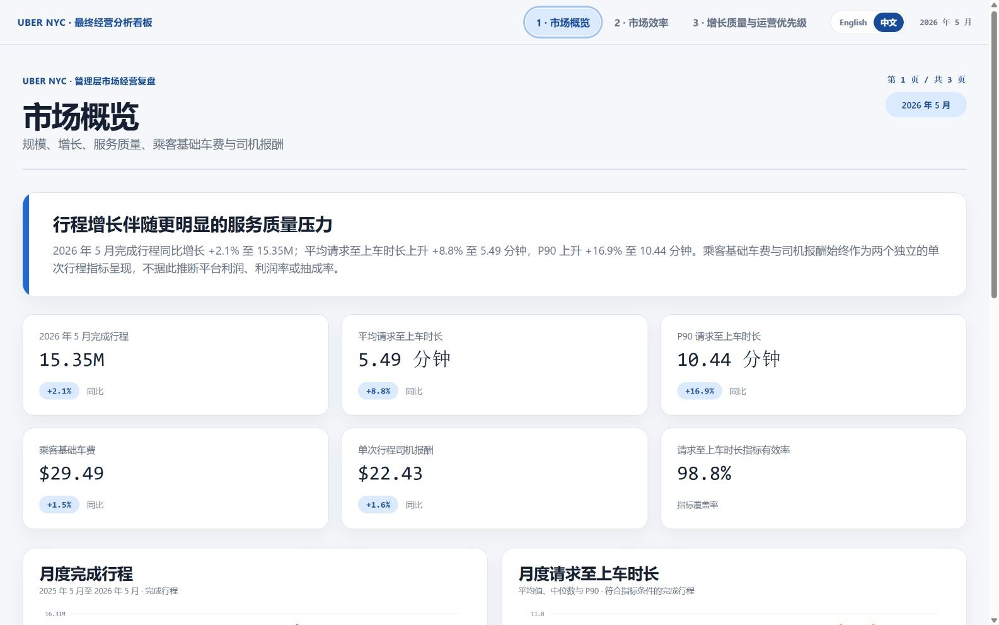
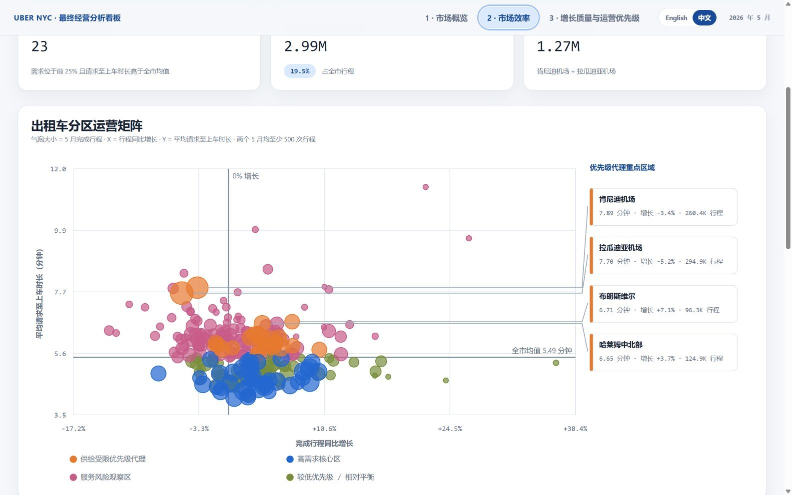
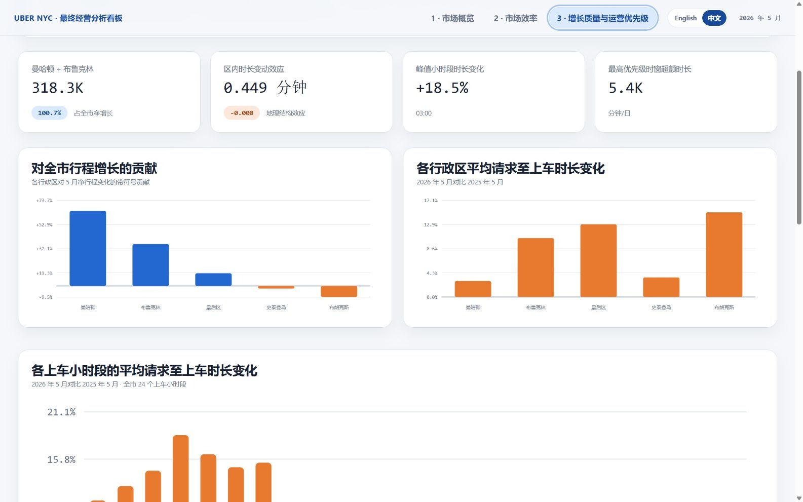

# Uber NYC 市场经营分析

[**English**](README.md) | [**中文**](README_zh.md)

**193.4M 次 Uber 完成行程 · 13 个月 · 纽约市 · Python + DuckDB**

> **核心业务问题：** 2026 年 5 月的行程增长是否伴随市场服务质量恶化？运营团队应优先调查哪些区域与时段？

[**打开三页双语 Dashboard**](https://raw.githack.com/TangsBigPiggy/business-analytics-portfolio/main/02-uber-nyc-growth-quality/dashboard/uber_nyc_final_dashboard.html?lang=zh#page-1) · [**阅读中文执行摘要报告**](https://raw.githack.com/TangsBigPiggy/business-analytics-portfolio/main/02-uber-nyc-growth-quality/reports/uber_nyc_growth_quality_report_zh.html) · [**阅读英文执行摘要报告**](https://raw.githack.com/TangsBigPiggy/business-analytics-portfolio/main/02-uber-nyc-growth-quality/reports/uber_nyc_growth_quality_report_en.html) · [**复现分析**](#复现方式)

[](https://raw.githack.com/TangsBigPiggy/business-analytics-portfolio/main/02-uber-nyc-growth-quality/dashboard/uber_nyc_final_dashboard.html?lang=zh#page-1)

**核心结论：** 2026 年 5 月完成行程同比增长 **2.1%** 至 **15.35M**；同期平均请求至上车时长上升 **8.8%** 至 **5.49 分钟**，P90 上升 **16.9%** 至 **10.44 分钟**。增长与服务恶化同时出现，但公共数据不足以证明二者存在因果关系。

Dashboard 是一个自包含 HTML，包含三个页签以及 **中文 / English** 切换按钮。两种语言共用同一套已验证数据与渲染逻辑，不依赖远程脚本或样式。

## 核心分析发现

1. **行程增长温和，但服务质量变化幅度更大。** 2026 年 5 月较 2025 年 5 月增加 315,947 次完成行程；平均值与尾部的请求至上车时长增幅明显更高。
2. **时长恶化覆盖面广，并非地理结构变化造成。** 经验证的分解结果将 **+0.449 分钟**归于各行政区内部的变化；地理结构变化抵消约 **0.008 分钟**，二者合计与全市 **+0.442 分钟**的变化一致。
3. **增长高度集中，但服务恶化扩展至全部行政区。** 曼哈顿与布鲁克林合计新增 **318.3K 次完成行程**，相当于全市净增长的 **100.7%**；其他区域的下降抵消了部分增量。五个行政区的平均请求至上车时长均上升。
4. **供给受限优先级代理识别出 23 个出租车分区。** 这些区域覆盖 **2.99M 次行程**，占 2026 年 5 月全市行程的 **19.5%**。肯尼迪机场与拉瓜迪亚机场的估算超额请求至上车时长负担排名前两位，合计约 **1.27M 分钟**。该指标仅用于运营排序，不构成司机供给不足的因果证明。
5. **凌晨时段的恶化最明显。** 03:00 上车小时段的平均请求至上车时长同比增幅最大，达到 **18.5%**。

## 业务建议

- **优先保护机场服务质量。** 结合星期—小时段排序，复盘肯尼迪机场与拉瓜迪亚机场的深夜/凌晨候车区、队列释放、派单和上车流程。
- **在扩大需求刺激前先做局部诊断。** 优先调查负担最高的哈莱姆、布鲁克林与布朗克斯区域，在条件允许时采用分阶段或随机化测试评估派单、司机驻点与上车流程调整。
- **将 00:00–07:00 设为重点服务修复时窗。** 同时监控完成行程、平均请求至上车时长与 P90 请求至上车时长，作为运营护栏。
- **在作出因果判断前补充内部市场数据。** 需要取消、未服务请求、司机在线时长、派单接受率、动态加价、预约与促销暴露等数据，才能区分供给、调度、产品与报送因素。

## Dashboard 预览

### 第 1 页 — 市场概览

[](https://raw.githack.com/TangsBigPiggy/business-analytics-portfolio/main/02-uber-nyc-growth-quality/dashboard/uber_nyc_final_dashboard.html?lang=zh#page-1)

### 第 2 页 — 市场效率

[](https://raw.githack.com/TangsBigPiggy/business-analytics-portfolio/main/02-uber-nyc-growth-quality/dashboard/uber_nyc_final_dashboard.html?lang=zh#page-2)

### 第 3 页 — 增长质量与运营优先级

[](https://raw.githack.com/TangsBigPiggy/business-analytics-portfolio/main/02-uber-nyc-growth-quality/dashboard/uber_nyc_final_dashboard.html?lang=zh#page-3)

以上图片均直接截取自仓库中的最终统一 HTML。第 2 页将四个管理层重点区域放入固定的侧边标注栏，通过引导线连接气泡，并为每个区域提供互不交叠的数值摘要。

## 方法与数据管道

```text
13 个 TLC HVFHV 月度 Parquet 文件（约 6.13 GB）
                       │
                       ▼
          DuckDB 扫描 + Uber 筛选（HV0003）
                       │
                       ▼
      紧凑分析数据集（月 / 日 / 区域 / 小时）
                       │
                       ▼
       2026 年 5 月 vs 2025 年 5 月诊断与分解
                       │
             ┌─────────┴─────────┐
             ▼                   ▼
       中英文执行报告       单一双语三页 Dashboard
             └─────────┬─────────┘
                       ▼
          数字、双语、结构与视觉封版 QA
```

- DuckDB 直接扫描月度 Parquet 文件，不创建巨型内存 pandas 表。
- 每一条 Uber 记录（`hvfhs_license_num = 'HV0003'`）均纳入完成行程计数；请求至上车时长、行程时长、里程、乘客基础车费与司机报酬分别采用独立的有效性规则。
- 分析窗口为 **2025 年 5 月至 2026 年 5 月**，焦点对比为 **2026 年 5 月与 2025 年 5 月**。
- 时间戳按报送的纽约当地时间理解。
- 仓库保留紧凑的聚合分析数据，无需下载 6.13 GB 原始文件即可重建诊断与 Dashboard 层。

## 核心指标定义

| 指标 | 定义 | 解读边界 |
|---|---|---|
| 完成行程 | Uber HVFHV 记录（`HV0003`）的行数。 | 仅代表完成记录，不代表全部请求或潜在需求。 |
| 请求至上车时长 | `pickup_datetime - request_datetime`，单位为分钟，限定在 0–60 分钟（含端点）。 | 服务代理指标，可能包含预约行程行为；`on_scene_datetime` 仅用于监控。 |
| P90 请求至上车时长 | 在符合请求至上车时长条件的完成行程中计算第 90 百分位数。 | 尾部服务指标，不衡量取消或未服务需求。 |
| 供给受限优先级代理 | 2026 年 5 月完成行程达到区域第 75 百分位及以上，且平均请求至上车时长高于全市均值的出租车分区。 | 基于观察到的完成行程与服务表现进行运营排序，不构成司机供给不足的因果证明。 |
| 估算超额请求至上车分钟数 | 区域有效行程 × `max(区域均值 - 全市均值, 0)`。 | 比较性负担代理，不代表流失需求、乘客成本或因果影响。 |
| 乘客基础车费 | 符合条件的完成行程中，非负 `base_passenger_fare` 的均值。 | 不含路桥费、小费、税费及其他费用；不代表平台收入。 |
| 司机报酬 | 符合条件的完成行程中，非负 `driver_pay` 的均值。 | 与乘客基础车费分开分析；二者之差不代表利润、利润率或抽成率。 |

完整的机器可读指标目录见 [`metric_definitions.csv`](data/processed/analytics/metric_definitions.csv)。

## 数据质量与局限

- **验证已通过：** 分析层、深度分析、Dashboard 数字、双语结构、跨语言数字一致性、本地链接与桌面/移动端视觉检查均已完成。
- 2026 年 5 月请求至上车时长指标有效率为 **98.77%**；各指标的独立排除规则不会从完成行程计数中删除记录。
- 月度质量监控在焦点同比月份之外发现个别行程时长覆盖、基础车费覆盖与行程时间不匹配异常。
- TLC 公共记录仅包含完成行程，不含未服务需求、取消、司机在线时长、派单接受率、动态加价倍数、预约或促销暴露。
- “供给受限优先级代理”与“估算超额请求至上车分钟数”仅是运营代理，不证明存在司机短缺或其他因果机制。
- 乘客基础车费与司机报酬始终作为两个独立指标分析；不推断利润、平台利润率或抽成率。
- TLC 说明行程记录由平台方提交，官方不保证数据完整无误。

## 仓库结构

```text
.
├── README.md                          # 英文 GitHub 首页
├── README_zh.md                       # 中文完整首页
├── requirements.txt
├── assets/dashboard/                  # 从最终 HTML 截取的中英文图片
├── dashboard/
│   ├── uber_nyc_final_dashboard.html  # 一个文件、三个页签、两种语言
│   ├── artifacts/                     # 规范化页面定义
│   └── qa/                            # 数字、双语与布局 QA
├── reports/
│   ├── uber_nyc_growth_quality_report_en.html
│   ├── uber_nyc_growth_quality_report_zh.html
│   ├── executive_report_artifact_en.json
│   ├── executive_report_artifact_zh.json
│   └── build_receipts.json
├── data/
│   ├── README.md
│   ├── README_zh.md
│   ├── reference/
│   └── processed/
│       ├── analytics/                 # 紧凑、可复用的分析数据集（约 31 MB）
│       └── analysis/                  # 已验证的诊断输出
├── scripts/
│   ├── 00_download_tlc_data.py
│   ├── 01_inspect_parquet.py
│   ├── 02_data_quality_audit.py
│   ├── 03_build_analytics_layer.py
│   ├── 04_deep_analysis.py
│   ├── 05_build_executive_report.py
│   ├── 06_build_final_dashboard.py
│   ├── 07_build_bilingual_delivery.py
│   ├── render_unified_dashboard.py
│   ├── validate_unified_dashboard.js
│   └── run_final_audit.py
└── qa/
    ├── final_audit.json
    └── final_audit.md
```

原始月度 Parquet、虚拟环境、IDE 设置、草稿、旧预览与重复成品均不进入公开仓库。

## 复现方式

### 1. 创建环境

建议使用 Python 3.11 或更高版本。

```bash
python -m venv .venv
python -m pip install -r requirements.txt
```

Windows 使用 `.venv\Scripts\activate`，macOS/Linux 使用 `source .venv/bin/activate`。

### 2. 基于仓库中的聚合数据重建

```bash
python scripts/04_deep_analysis.py
python scripts/05_build_executive_report.py
python scripts/07_build_bilingual_delivery.py
python scripts/06_build_final_dashboard.py
python scripts/run_final_audit.py
```

`05_build_executive_report.py` 重建英文规范化报告 artifact；`07_build_bilingual_delivery.py` 生成中文 artifact，验证两种语言的数字证据与章节顺序一致，并在 Data Analytics 便携报告构建器可用时生成两份 HTML；`06_build_final_dashboard.py` 重建三个页面 artifact 与单一双语 Dashboard HTML。

### 3. 从原始 TLC 记录完整重建

```bash
python scripts/00_download_tlc_data.py
python scripts/01_inspect_parquet.py
python scripts/02_data_quality_audit.py
python scripts/03_build_analytics_layer.py
python scripts/04_deep_analysis.py
python scripts/05_build_executive_report.py
python scripts/07_build_bilingual_delivery.py
python scripts/06_build_final_dashboard.py
python scripts/run_final_audit.py
```

下载器会将 13 个文件写入已被 Git 忽略的 `data/raw/`。

## 数据来源

- [NYC TLC Trip Record Data](https://www.nyc.gov/site/tlc/about/tlc-trip-record-data.page) — 官方 High Volume For-Hire Vehicle 月度 Parquet 下载与数据发布说明。
- [High Volume FHV Trip Records Data Dictionary](https://www.nyc.gov/assets/tlc/downloads/pdf/data_dictionary_trip_records_hvfhs.pdf) — 字段定义，并注明 `HV0003` 为 Uber。
- [NYC TLC Taxi Zone Lookup Table](https://d37ci6vzurychx.cloudfront.net/misc/taxi_zone_lookup.csv) — 行政区与出租车分区名称。
- 原始文件路径规则：`https://d37ci6vzurychx.cloudfront.net/trip-data/fhvhv_tripdata_YYYY-MM.parquet`。

本项目为独立分析作品集项目，与 Uber 或纽约市出租车与豪华轿车管理委员会（NYC TLC）无隶属或背书关系。
